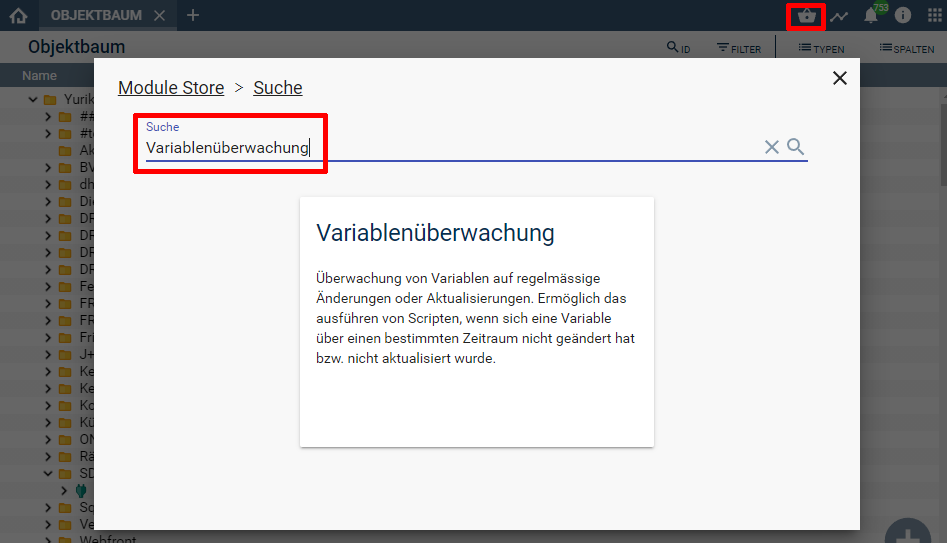
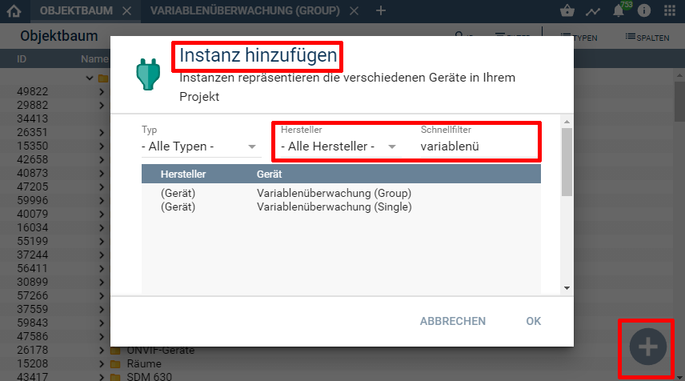
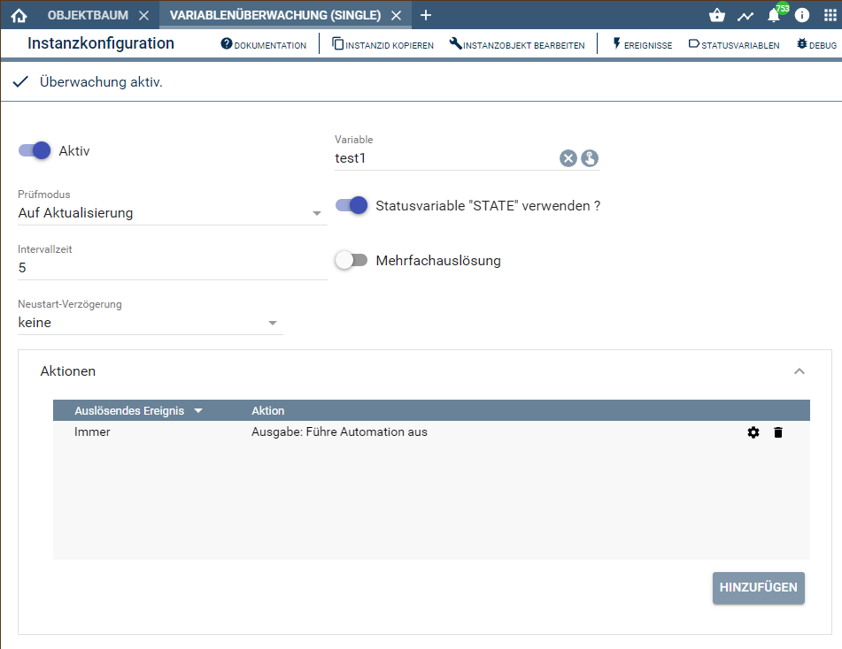
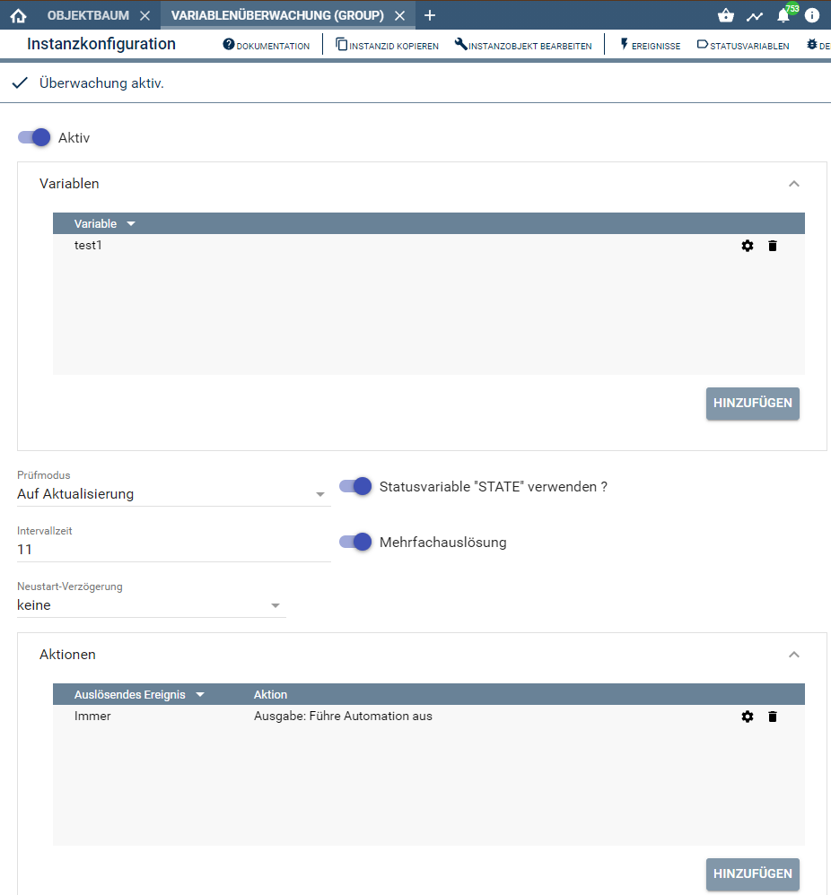

[](https://www.symcon.de/service/dokumentation/entwicklerbereich/sdk-tools/sdk-php/)
[](https://community.symcon.de/t/modul-notrigger-ueberwachen-von-ips-variablen-auf-ausbleibende-aktualisierung-oder-veraenderung/42474)
  
[](https://creativecommons.org/licenses/by-nc-sa/4.0/)
[](https://github.com/Nall-chan/NoTrigger/actions) [](https://github.com/Nall-chan/NoTrigger/actions)  
[](#5-spenden)[](#5-spenden)  

# Variablenüberwachung (NoTrigger) <!-- omit in toc -->  

Überwachen von IPS-Variablen auf ausbleibende Aktualisierung oder Veränderung.  

## Dokumentation <!-- omit in toc -->  

**Inhaltsverzeichnis**

- [1. Funktionsumfang](#1-funktionsumfang)
- [2. Voraussetzungen](#2-voraussetzungen)
- [3. Installation](#3-installation)
- [4. Einrichten der Instanzen in IP-Symcon](#4-einrichten-der-instanzen-in-ip-symcon)
  - [1. Variablenüberwachung (single)](#1-variablenüberwachung-single)
  - [2. Variablenüberwachung (group)](#2-variablenüberwachung-group)
- [5. Aktionen konfigurieren](#5-aktionen-konfigurieren)
- [6. Variablen im PHP-Script bei 'Führe Automation aus'](#6-variablen-im-php-script-bei-führe-automation-aus)
- [7. Anhang](#7-anhang)
  - [1. Danksagung](#1-danksagung)
  - [2. GUID der Module](#2-guid-der-module)
  - [3. Parameter der Instanzen](#3-parameter-der-instanzen)
  - [4. Changelog](#4-changelog)
  - [5. Spenden](#5-spenden)
- [8. Lizenz](#8-lizenz)

## 1. Funktionsumfang

Überwachen von IPS-Variablen auf ausbleibende Aktualisierung oder Veränderung.  
Grundidee war festzustellen ob bestimme (Status)Variablen regelmäßig aktualisiert werden, um dann, bei ausbleiben der Aktualisierung, entsprechend hierauf reagieren zu können.  
  
Beispiele:  
  
-- Homematic-Rauchmelder  
Alle paar (5?) Tage senden diese ihren Status an die CCU/Lan-Adapter. Sollte ein Melder dies nicht mehr machen, sollte eine eMail versendet werden.  
  
-- EM1000 / CUL  
Alle 5 Minuten werden die Datensätze von den Geräten gesendet, sollte dies nicht mehr passieren, soll die I/O Instanz einmal geschlossen und neu geöffnet werden.  
  
-- Daten von einem Gerät im Netzwerk per Push oder Poll.  
Alle 10 Sekunden kommen Daten per (beliebiges Netzwerkgerät) rein. Im Fehlerfall soll ein Script das Gerät per Telnet neu starten.  
  
-- eMail-Abfrage  
Alle 5 Minuten soll IPS eMails prüfen. Ändert sich der Zeitstempel der Variable 'Last message' 15min lang nicht, wird eine Meldung auf dem Webfront ausgegeben.  
  
-- 1Wire / ModBus  
Alle 10 Sek werden Werte gelesen. Ändern ein Sensor sich 60 Sekunden lang nicht ist entweder abgeklemmt oder defekt => Meldung per eMail  
  
-- Erinnerung Lüften  
Einmal am Tag müssen drei Fenster zum Lüften geöffnet werden, nach 36h wird eine Meldung erzeugt das noch nicht gelüftet wurde.  
  
etc....  
  
Die Funktion besteht im wesentlichen darin festzustellen ob sich eine Variable ändert bzw. aktualisiert.  
Sollte Dies innerhalb der konfigurierten Intervall-Zeit geschehen, wird keine Aktion ausgelöst.  
Nach Ablauf der Intervall-Zeit wird, je nach Konfiguration, eine Statusvariable gesetzt und die konfigurierten Aktionen ausgelöst.  
Über die konfigurierbaren Aktionen können dann weitere Maßnahmen und Steuerungen erfolgen (Ablaufplan starten, Script starten, WFC_Notification / eMail / Steckdose aus & einschalten etc).  

## 2. Voraussetzungen

 - IPS ab Version 6.1  
 
## 3. Installation

 Über den 'Module-Store' in IPS das Modul 'Variablenüberwachung' hinzufügen.  
  **Bei kommerzieller Nutzung (z.B. als Errichter oder Integrator) wenden Sie sich bitte an den Autor.**  

  

## 4. Einrichten der Instanzen in IP-Symcon

### 1. Variablenüberwachung (single)

 Unter Instanz hinzufügen ist die Variablenüberwachung unter 'Nall-chan' oder dem Schnellfilter zu finden.  
 Jeweils einmal als Typ Single und Group.  

  

 Nach dem Anlegen der Instanz ist diese noch entsprechend zu konfigurieren.  
        
 - Aktiv :  
    Um die Überwachung zu aktivieren bzw. desaktivieren.  
        
 - Variable:  
    Die zu überwachende Variable auswählen.  
        
 - Prüfmodus:  
    Legt fest ob sich der Wert der Variable(n) verändert haben muss, oder ob es reichte das eine Variable aktualisiert wurde auch wenn sich der Wert nicht geändert hat.  
        
 - Intervall:  
    Der Zeitraum in Sekunden in dem sich die Variable(n) nach dem unter Prüfmodus festgelegten Modus geändert haben muss. Wird  dieser Zeitraum überschritten, wird die Statusvariable 'STATE'  gesetzt und/oder das Ziel-Script gestartet. (max. Wert 599000000)  
        
 - Statusvariable 'STATE' verwenden:  
    Hiermit kann eine Statusvariable der Instanz zu/weg geschaltet werden. (z.B. zur Visualisierung oder Abfrage in einem Ablaufplan).  
        
 - Neustart-Verzögerung:  
    Grundsätzlich wird immer ein Alarm ausgelöst, wenn die letzte Änderung/Aktualisierung der zu überwachenden Variable länger her ist als der eingestellte Intervall. Dies kann bei einem Dienst-Neustart zu falschen Meldungen führen.  
    Beispiele wo keine Verzögerung nötig ist sind z.B. Geräte welche sich nur einmal pro Woche / Monat etc. melden sollten, da es hier sehr unwahrscheinlich ist das ein Neustart genau in diesen Zeitpunkt fällt wo sich die Variable ändern sollte. Hier ist es sogar ungünstig mit einer Verzögerung zu arbeiten, weil dann vielleicht erst nach 10 statt 5 Tagen auffällt dass der Rauchmelder schon lange nicht mehr sendet.  

    Bei z.B. 1-Wire/ModBus Geräten und anderen Instanzen welche IPS mit einem internen Timer ausließt, sollte die Verzögerung auf Intervall stehen. Somit hat IPS beim starten erst mal Zeit die Geräte abzufragen bzw. die Daten zu lesen, bevor es zu einen Alarm kommt.  
    (IPS-Neustart 30 Sekunden, letzter Wert vor Neustart ist 0sek, Intervall ist 5 Sekunden. => Startet IPS, gibt es ohne eingestellter Verzögerung gleich einen Alarm, da der letzte Wert vor über 30 Sekunden gelesen wurde und somit größer als der eingestellte Intervall von 5 Sekunden ist.)  
    Die Verzögerung 'bis Aktualisierung' sollte für Geräte genutzt werden, wo man nicht genau weiß wann Sie nach einen Neustart wieder mit IPS kommunizieren. Die Überwachung und somit die Intervall-Zeit beginnt erst, wenn die Variable geändert/aktualisiert wurde.  
    Dies birgt aber auch ein Risiko: Sollte nach dem Neustart die Variable nie geändert/aktualisiert werden, wird auch nie ein Alarm erzeugt.  
        
 - Mehrfachauslösung:  
    Normalerweise wird nur beim Übergang von Ruhe/Alarm und Alarm/Ruhe die eigene Statusvariable gesetzt und alle Aktionen gestartet.  
    Wird die Mehrfachauslösung aktiviert, werden auch bei Updates von Ruhe/Ruhe und Alarm/Alarm alle Aktionen ausgelöst.  

     

### 2. Variablenüberwachung (group)

 Alle zu überwachenden Variablen sind immer ODER verknüpft, es reicht also wenn Eine sich nicht innerhalb der Intervallzeit ändert/aktualisiert um eine Alarm-Meldung zu generieren. Im Umkehrschluss heißt dies dass die Ruhemeldung nur auslöst, wenn alle überwachten Variablen sich innerhalb der Intervallzeit ändert/aktualisiert haben.  

 Die Konfiguration und die Funktion sind ähnlich. Folgende Einstellungen unterscheiden sich:

 - Variable:  
    In der Liste die zu überwachenden Variablen auswählen.  

 - Statusvariable 'STATE' verwenden:  
    Der Zustand der Variable immer eine ODER Verknüpfung auf die Alarmmeldungen
    Somit wird die Variable 'true' sobald eine Variable einen Alarm auslöst und 'false' wenn alle Variablen keinen Alarm mehr auslösen.  
        
  - Mehrfachauslösung:  
    Wird die Mehrfachauslösung aktiviert, werden für jede überwachte Variable der Übergang Ruhe/Alarm und Alarm/Ruhe die Aktionen ausgelöst.  
    Wird die Mehrfachauslösung deaktiviert, wird nur der erste Alarm und die letzte Ruhemeldung zum auslösen der Aktionen benutzt.  

      

## 5. Aktionen konfigurieren

   Hier werden die gewünschten Aktionen hinterlegt, welche ausgeführt werden sollen.  
   Bei jeder Aktion kann noch ausgewählt werden ob sie 'Bei Auslösung', 'Bei Rücksetzen' oder 'immer' ausgeführt werden soll.  
   Zusätzlich können Bedingungen angegeben werden, welche das ausführen einer Aktion erlauben oder verhindern.  
   Für Aktionen werden entsprechende Parameter übergeben, welche z.B. bei 'Führe Automation aus' in einem PHP-Script zur Verfügung stehen. 

## 6. Variablen im PHP-Script bei 'Führe Automation aus'

 Folgende Felder im Array der PHP-Variable $_IPS stehen im Ziel-Script zur Verfügung:  

|  Index   |   Typ   |                       Beschreibung                       |
| :------: | :-----: | :------------------------------------------------------: |
|  VALUE   | boolean | Aktueller Status wobei True = Alarm und False = Ruhe ist |
| OLDVALUE | boolean |                     vorheriger Wert                      |
|  EVENT   | integer |     Instanz ID der auslösenden Variablenüberwachung      |
| VARIABLE | integer |   ID der Variable welche die Auslösung verursacht hat    |
|  SENDER  | string  |                  'NoTrigger' FixString                   |

 Ein PHP-Script sollte immer den Wert 'VALUE' abfragen, damit unterschieden werden kann ob es sich um eine Alarm-Meldung oder Ruhe-Meldung handelt, falls bei 'Auslösendes Ereignis' 'immer' eingestellt wurde:  

```php
        if ($_IPS['VALUE'])
        {
            // Alarm wurde ausgelöst
        } else {
            // Ruhemeldung nach	Alarm
        }
```

## 7. Anhang

### 1. Danksagung

 Idee von MCS-51 mit dem IPSLibrary-Modul IPS-Health welche nie offiziell Verbreitet wurde.  
 Umsetzung von Nall-chan als natives IPS-Modul für IPS ab Version 3.1.  

### 2. GUID der Module

|            Instanz            |                  GUID                  |
| :---------------------------: | :------------------------------------: |
| Variablenüberwachung (Single) | {BACCE313-C8F2-4189-B128-74A6888DAD21} |
| Variablenüberwachung (Group)  | {28198BA1-3563-4C85-81AE-8176B53589B8} |

### 3. Parameter der Instanzen

**Eigenschaften von Variablenüberwachung (Single):**  

| Eigenschaft   |   Typ   | Standardwert | Funktion                                                                  |
| :------------ | :-----: | :----------: | :------------------------------------------------------------------------ |
| Active        | boolean |    false     | Aktivieren / Deaktivieren der Überwachung                                 |
| VarID         | integer |      0       | Variable welche überwacht werden soll                                     |
| CheckMode     | integer |      0       | Überwachung auf Aktualisierung (0) oder Änderung (1)                      |
| Timer         | integer |      0       | Zeit in Sek bis zum Auslösen eines Alarm                                  |
| HasState      | boolean |     true     | Variable 'STATE' anlegen                                                  |
| StartUp       | integer |      0       | Neustart-Verzögerung 0 = keine, 1 = Intervallzeit, 2 = bis Aktualisierung |
| MultipleAlert | boolean |    false     | Mehrfachauslösung                                                         |
| Actions       | string  |      []      | JSON-String mit Daten der zu startenden Aktionen                          |

**Eigenschaften von Variablenüberwachung (Group):**  

| Eigenschaft   |   Typ   | Standardwert | Funktion                                                                  |
| :------------ | :-----: | :----------: | :------------------------------------------------------------------------ |
| Active        | boolean |    false     | Aktivieren / Deaktivieren der Überwachung                                 |
| Variables     | string  |      []      | JSON-String mit Daten der zu überwachenden Variablen                      |
| CheckMode     | integer |      0       | Überwachung auf Aktualisierung (0) oder Änderung (1)                      |
| Timer         | integer |      0       | Zeit in Sek bis zum Auslösen eines Alarm                                  |
| HasState      | boolean |     true     | Variable 'STATE' anlegen                                                  |
| StartUp       | integer |      0       | Neustart-Verzögerung 0 = keine, 1 = Intervallzeit, 2 = bis Aktualisierung |
| MultipleAlert | boolean |    false     | Mehrfachauslösung                                                         |
| Actions       | string  |      []      | JSON-String mit Daten der zu startenden Aktionen                          |

### 4. Changelog  

**Version 2.80:**  
 - Version setzt IPS 7.0 voraus.  
 - Bedingungen können bei Aktionen ausgewählte werden, um Aktionen zu blockieren.  

**Version 2.72:**  
 - Timer wurden nicht zuverlässig angehalten, wenn Instanzen inaktiv geschaltet wurden.  
 - Timer wurde gestartet, obwohl Instanz inaktiv war.  

**Version 2.70:**  
 - IPS 6.1 als Voraussetzung.  
 - Bei auslösen der Überwachungen können mehrere Aktionen gestartet werden.  
 - Vorhandenes Alarm-Script wird automatisch in eine Aktion übertragen.  
 - Gruppenüberwachung von Variablen benutzt jetzt eine Liste und keine Links.  
 - Bei Gruppenüberwachung werden die Links automatisch in die Variablen-Liste überführt.  

**Version 2.61:**  
 - Fehlermeldung beim IPS Shutdown.  

**Version 2.6:**  
 - Schreibfehler korrigiert.  
 - Fehlende Übersetzungen ergänzt.  

**Version 2.5:**  
 - Release für IPS 5.1 und den Module-Store   

**Version 2.2:**  
 - Fixes für IPS 5.0  

**Version 2.1:**  
 - Fix: Timer in Create verschoben  

**Version 2.0:**  
 - Erste Version für IPS 4.1  

**Version 1.1:**  
 - Erstes öffentliches Release im Forum  

**Version 1.0.0.7:**  
 - Erstes internes Release mit Gruppenüberwachung  

### 5. Spenden  
  
  Die Library ist für die nicht kommerzielle Nutzung kostenlos, Schenkungen als Unterstützung für den Autor werden hier akzeptiert:  

  PayPal:  
<a href="https://www.paypal.com/donate?hosted_button_id=G2SLW2MEMQZH2" target="_blank"></a>  

  Wunschliste:  
[](https://www.amazon.de/hz/wishlist/ls/YU4AI9AQT9F?ref_=wl_share)  

## 8. Lizenz  

[CC BY-NC-SA 4.0](https://creativecommons.org/licenses/by-nc-sa/4.0/)  
